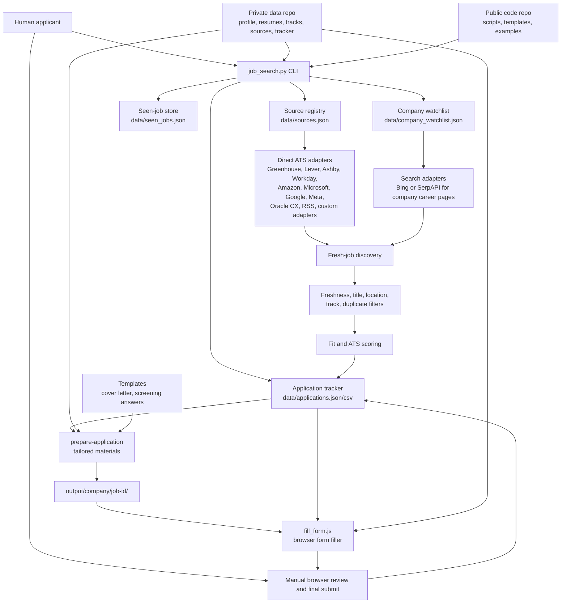
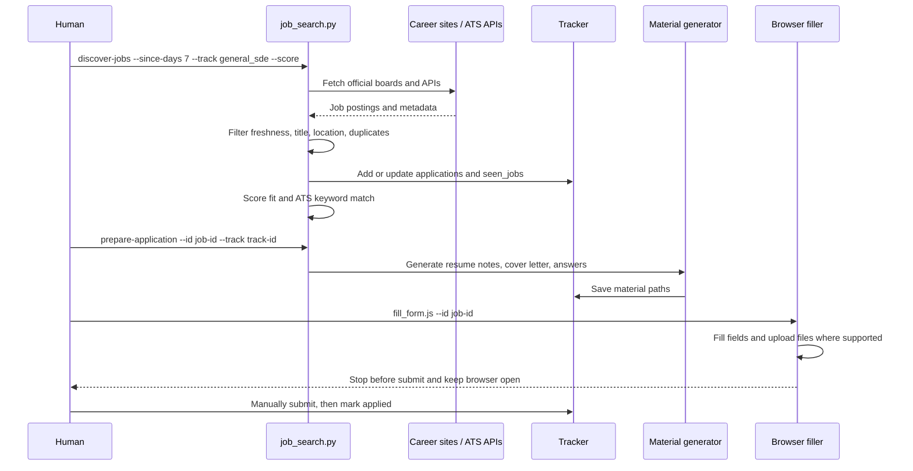

# Job Search Agent

A local, human-in-the-loop job search and application assistant.

This project discovers fresh jobs from official company career sites and ATS APIs, filters and scores them against a candidate profile, generates tailored application materials, and fills supported ATS forms up to the final review step. It is designed to keep private candidate data out of the public code repository and to keep humans in control of every final application submission.

## What This Project Does

- Discovers jobs from configured company sources such as Greenhouse, Lever, Ashby, Workday, Amazon Jobs, Microsoft Careers, Google Careers, Meta Careers, Oracle CX, RSS feeds, and other supported career systems.
- Filters by freshness, role, location, track, and duplicate history.
- Records `posted_at`, `first_seen`, `last_seen`, source metadata, scoring results, and application status.
- Supports multiple job-search tracks, such as general SDE, QA/SDET, mobile, backend, or FDE-style roles.
- Generates tailored resume notes, cover letters, and screening-question drafts.
- Opens and fills supported ATS forms with a dedicated browser profile, then stops before final submit.
- Produces local tracker data in JSON and CSV for review.

It intentionally does not:

- Click final submit buttons.
- Scrape LinkedIn aggressively or bypass anti-bot systems.
- Send recruiter outreach automatically.
- Store real resumes, profiles, trackers, or browser sessions in the public repo.

## Repository Model

The project is meant to be used with two repositories:

```text
job-search-agent/          public code repository
  README.md
  job-search/
    scripts/
    templates/
    examples/
    WORKFLOW.md

job-search-private/        private data repository, not published
  profile.json
  resume/
  tracks/
  data/
    sources.json
    company_watchlist.json
    applications.json
    applications.csv
    seen_jobs.json
    discovery_runs/
  output/
  .browser-profile/
```

The public repo contains scripts, templates, examples, and documentation. The private repo contains the real candidate profile, resumes, source lists, job tracker, generated materials, screenshots, and browser profiles.

Set the private repo location with:

```bash
export JOB_SEARCH_PRIVATE_DIR="$HOME/job-search-private"
```

## Architecture



## Main Workflow



## Setup

Clone the public repo and create a private data directory:

```bash
git clone https://github.com/<owner>/job-search-agent.git
mkdir -p "$HOME/job-search-private"
export JOB_SEARCH_PRIVATE_DIR="$HOME/job-search-private"
```

Install the optional Node dependencies used by the browser filler:

```bash
cd job-search-agent/job-search
npm install
```

Initialize private files from examples:

```bash
cd job-search-agent
python3 job-search/scripts/job_search.py init-person
```

Then edit the private files:

```text
$JOB_SEARCH_PRIVATE_DIR/profile.json
$JOB_SEARCH_PRIVATE_DIR/resume/master_resume.md
$JOB_SEARCH_PRIVATE_DIR/data/sources.json
$JOB_SEARCH_PRIVATE_DIR/data/company_watchlist.json
$JOB_SEARCH_PRIVATE_DIR/data/applications.json
```

The Markdown resume is used for scoring and material generation. The PDF resume referenced from `profile.json` or a track config is uploaded to ATS forms.

## Private Data Layout

The default private layout is:

```text
$JOB_SEARCH_PRIVATE_DIR/
  profile.json
  resume/
    master_resume.md
    resume.pdf
  tracks/
    qa_engineer/
      track.json
      master_resume.md
      resume.pdf
    fde_ai_engineer/
      track.json
      master_resume.md
      resume.pdf
  data/
    sources.json
    company_watchlist.json
    applications.json
    applications.csv
    seen_jobs.json
    discovery_runs/
  output/
    company/
      job-id/
        jd.md
        score_report.md
        resume_tailored.md
        cover_letter.md
        screening_answers.md
  .browser-profile/
```

`applications.json` is the source of truth. `applications.csv` is regenerated from it for easier review.

## Sources

`data/sources.json` defines official career boards and ATS sources. Whenever possible, sources should use structured identifiers instead of generic HTML scraping.

Example:

```json
{
  "sources": [
    {
      "company": "Example Greenhouse Company",
      "platform": "greenhouse",
      "board": "example",
      "url": "https://job-boards.greenhouse.io/example"
    },
    {
      "company": "Example Lever Company",
      "platform": "lever",
      "site": "example",
      "url": "https://jobs.lever.co/example"
    },
    {
      "company": "Example Ashby Company",
      "platform": "ashby",
      "board": "example",
      "url": "https://jobs.ashbyhq.com/example"
    }
  ]
}
```

The codebase also supports company-specific or platform-specific adapters, including:

- `greenhouse`
- `lever`
- `ashby`
- `workday`
- `amazon_jobs`
- `microsoft_jobs`
- `google_jobs`
- `meta_jobs`
- `oracle_cx`
- `boa_careers`
- RSS-based sources

Direct ATS/API sources are preferred because they are cheaper, more reliable, and expose better metadata than general web search.

## Company Watchlist

Some companies use custom or JavaScript-heavy career sites that are hard to parse directly. For those, use `data/company_watchlist.json`.

The watchlist route builds targeted search queries such as:

```text
site:jobs.careers.microsoft.com "Software Engineer" "Redmond"
site:amazon.jobs "Software Development Engineer" "Seattle"
site:careers.google.com "Software Engineer" "early career"
```

It can use Bing Web Search or SerpAPI, then resolves results back to official company URLs before filtering and tracking.

## Tracks

Tracks let one candidate search and apply with different strategies.

Examples:

- `general_sde`: software engineer, backend, platform, DevOps, AI infrastructure.
- `qa_engineer`: QA analyst, SDET, test automation, quality engineer.
- `fde_ai_engineer`: forward-deployed engineering, applied AI, customer-facing technical implementation.
- `mobile_engineer`: iOS, Android, React Native, mobile platform.

A track may define:

- Search keywords.
- Positive and negative scoring signals.
- Location preferences.
- Experience-level preferences.
- Track-specific Markdown resume.
- Track-specific PDF resume.

If the same URL is discovered by multiple tracks, the tracker keeps one application record and appends all matched tracks to `matched_tracks`. `prepare-application` uses `target_track` unless overridden.

## Discovery Commands

Run fresh discovery against configured sources:

```bash
python3 job-search/scripts/job_search.py discover-jobs --since-days 7 --track general_sde --score
```

Run only one source:

```bash
python3 job-search/scripts/job_search.py discover-jobs \
  --since-days 7 \
  --track qa_engineer \
  --source-company "Microsoft" \
  --score
```

Protect the run from one slow source:

```bash
python3 job-search/scripts/job_search.py discover-jobs \
  --since-days 7 \
  --source-timeout-seconds 30 \
  --score
```

Find jobs from search-provider results:

```bash
python3 job-search/scripts/job_search.py discover-web-jobs \
  --provider bing \
  --since-days 7 \
  --track general_sde \
  --score \
  --update-sources
```

Run watchlist discovery:

```bash
python3 job-search/scripts/job_search.py discover-watchlist-jobs \
  --provider bing \
  --track general_sde \
  --since-days 7 \
  --score
```

Useful variants:

```bash
python3 job-search/scripts/job_search.py discover-jobs --since-hours 24 --score
python3 job-search/scripts/job_search.py discover-jobs --since-days 7 --include-unknown-posted-date
python3 job-search/scripts/job_search.py discover-jobs --since-days 7 --no-role-filter
```

## Freshness and Deduplication

The discovery pipeline records:

- `posted_at`: when the ATS or source says the job was posted.
- `updated_at`: when available from the source.
- `first_seen`: when this system first saw the job.
- `last_seen`: most recent discovery timestamp.
- `source`: source board or search route.
- `source_query`: search query when relevant.

Deduplication uses canonical URLs and source-specific job identifiers where available. A job found today and again tomorrow should update `last_seen`, not become a duplicate application. Different roles at the same company are tracked separately.

By default, fresh discovery prefers jobs with known posting dates. Jobs with unknown posting dates can be included with `--include-unknown-posted-date`.

## Scoring

The scoring step compares a job description with the profile and track resume. It writes fields such as:

- `fit_score`
- `ats_score`
- `matched_keywords`
- `resume_keyword_matches`
- `missing_keywords`
- `dealbreakers`
- `action_items`

Scoring is a triage aid, not an automated decision maker. The intended workflow is to review high-scoring roles first, then manually decide whether to apply.

## Preparing Applications

Generate local application materials:

```bash
python3 job-search/scripts/job_search.py prepare-application --id <application-id>
```

Use a specific track:

```bash
python3 job-search/scripts/job_search.py prepare-application \
  --id <application-id> \
  --track qa_engineer
```

This writes files under:

```text
$JOB_SEARCH_PRIVATE_DIR/output/<company>/<job-id>/
  jd.md
  score_report.md
  resume_tailored.md
  cover_letter.md
  screening_answers.md
```

Generated text should be reviewed before submission. The system should not invent skills, employment history, education, authorization status, or metrics.

## Browser Form Filling

Fill a supported form up to manual review:

```bash
node job-search/scripts/fill_form.js --id <application-id>
```

With a track-specific application:

```bash
node job-search/scripts/fill_form.js --id <application-id> --person <person-id>
```

The browser filler:

- Uses a dedicated ATS browser profile.
- Disables extensions by default, which reduces interference from sidebars and injected UI.
- Uploads configured resume and cover letter where supported.
- Fills conservative known fields.
- Stops for login, CAPTCHA, account creation, e-signature, or unclear questions.
- Stops before final submit.
- Keeps Chrome open by default for manual review.

Use this only for dry runs where closing the browser is desired:

```bash
node job-search/scripts/fill_form.js --id <application-id> --close-when-done
```

## Aggregator Leads

Aggregator sites can be useful for discovery but are not treated as final application targets.

The intended pattern is:

1. Use a logged-in browser manually or semi-automatically to find leads on an aggregator.
2. Record company and job leads.
3. Resolve those companies to official ATS or career pages.
4. Add official boards to `sources.json`.
5. Run `discover-jobs` against official sources.

Example:

```bash
JOB_SEARCH_PRIVATE_DIR=/path/to/private \
node job-search/scripts/collect_aggregator_leads.js --provider jobright --resolve-sources
```

This keeps the application workflow anchored on official company systems and avoids depending on brittle aggregator pages.

## Notifications

Generate a notification summary:

```bash
python3 job-search/scripts/job_search.py notify
```

Send after generating, using the email provider configured in the private profile:

```bash
python3 job-search/scripts/job_search.py run --send-email
```

The notification scripts are restricted to the candidate's own email address from `profile.json`.

## Source Auditing

Inspect source quality and platform detection:

```bash
python3 job-search/scripts/job_search.py audit-sources
python3 job-search/scripts/job_search.py classify-sources --custom-only
```

After reviewing classifications:

```bash
python3 job-search/scripts/job_search.py classify-sources --custom-only --apply
```

This helps migrate generic career-page URLs into structured ATS entries.

## Safety and Privacy Principles

- Keep the public repo free of real profiles, resumes, trackers, generated cover letters, screenshots, and browser sessions.
- Commit only examples and code to the public repo.
- Never automate final submission.
- Never bypass CAPTCHA, login walls, or anti-bot controls.
- Prefer official ATS APIs and company career pages over scraping aggregators.
- Treat generated cover letters and screening answers as drafts.
- Preserve truthful application data.
- Keep human review in the loop for every application.

## Current Limitations

- Some enterprise career sites are JavaScript-heavy and need dedicated adapters.
- Location parsing can be imperfect on custom career systems.
- Some sources expose no reliable posting date.
- Search-provider routes can be rate-limited or quota-limited.
- Browser form filling varies by ATS and may require manual correction.
- The project is optimized for local personal use rather than a hosted multi-user service.

## Typical Daily Run

```bash
export JOB_SEARCH_PRIVATE_DIR="$HOME/job-search-private"

cd "$HOME/job-search-agent"

python3 job-search/scripts/job_search.py discover-jobs \
  --since-days 7 \
  --track general_sde \
  --source-timeout-seconds 30 \
  --score

python3 job-search/scripts/job_search.py discover-watchlist-jobs \
  --provider bing \
  --track general_sde \
  --since-days 7 \
  --score

python3 job-search/scripts/job_search.py sync-csv
```

Then review `applications.csv`, choose jobs to apply to, prepare materials, and run the browser filler one job at a time.

## More Details

See [job-search/WORKFLOW.md](job-search/WORKFLOW.md) for operational notes and command examples.
