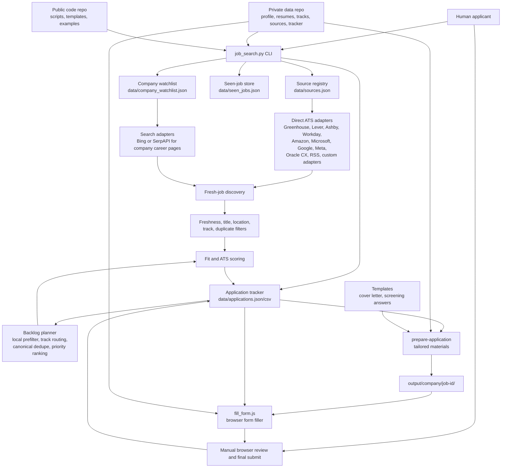
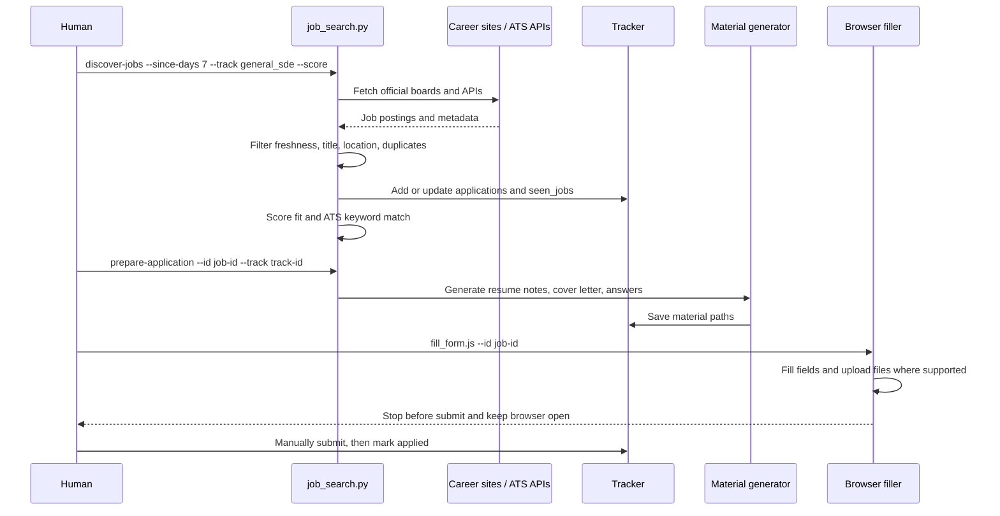

# Job Search Agent

A local, human-in-the-loop job search and application assistant.

This project discovers fresh jobs from official company career sites and ATS APIs, filters and scores them against a candidate profile, generates tailored application materials, and fills supported ATS forms up to the final review step. It is designed to keep private candidate data out of the public code repository and to keep humans in control of every final application submission.

## What This Project Does

- Discovers jobs from configured company sources such as Greenhouse, Lever, Ashby, Workday, Amazon Jobs, Microsoft Careers, Google Careers, Meta Careers, Oracle CX, RSS feeds, and other supported career systems.
- Filters by freshness, role, location, track, and duplicate history.
- Records `posted_at`, `first_seen`, `last_seen`, source metadata, scoring results, and application status.
- Supports multiple job-search tracks, such as general SDE, QA/SDET, mobile, backend, or FDE-style roles.
- Generates tailored resume notes, cover letters, and screening-question drafts.
- Opens and fills supported ATS forms with a dedicated browser profile, then stops before final submit.
- Produces local tracker data in JSON and CSV for review.

It intentionally does not:

- Click final submit buttons.
- Scrape LinkedIn aggressively or bypass anti-bot systems.
- Send recruiter outreach automatically.
- Store real resumes, profiles, trackers, or browser sessions in the public repo.

## Repository Model

The project is meant to be used with two repositories:

```text
job-search-agent/          public code repository
  README.md
  job-search/
    scripts/
    templates/
    examples/
    WORKFLOW.md

job-search-private/        private data repository, not published
  profile.json
  resume/
  tracks/
  data/
    sources.json
    company_watchlist.json
    local_company_registry.json
    local_coverage.json
    applications.json
    applications.csv
    seen_jobs.json
    discovery_runs/
  output/
  .browser-profile/
```

The public repo contains scripts, templates, examples, and documentation. The private repo contains the real candidate profile, resumes, source lists, job tracker, generated materials, screenshots, and browser profiles.

Set the private repo location with:

```bash
export JOB_SEARCH_PRIVATE_DIR="$HOME/job-search-private"
```

## Architecture


```mermaid
flowchart TD
  User["Human applicant"] --> CLI["job_search.py CLI"]
  User --> BrowserReview["Manual browser review and final submit"]

  PrivateRepo["Private data repo<br/>profile, resumes, tracks, sources, tracker"] --> CLI
  PublicRepo["Public code repo<br/>scripts, templates, examples"] --> CLI

  CLI --> Sources["Source registry<br/>data/sources.json"]
  CLI --> Watchlist["Company watchlist<br/>data/company_watchlist.json"]
  CLI --> Seen["Seen-job store<br/>data/seen_jobs.json"]
  CLI --> Tracker["Application tracker<br/>data/applications.json/csv"]

  Sources --> DirectAdapters["Direct ATS adapters<br/>Greenhouse, Lever, Ashby, Workday,<br/>Amazon, Microsoft, Google, Meta,<br/>Oracle CX, RSS, custom adapters"]
  Watchlist --> SearchAdapters["Search adapters<br/>Bing or SerpAPI for company career pages"]
  DirectAdapters --> Discovery["Fresh-job discovery"]
  SearchAdapters --> Discovery

  Discovery --> Filters["Freshness, title, location,<br/>track, duplicate filters"]
  Filters --> Scoring["Fit and ATS scoring"]
  Scoring --> Tracker

  Tracker --> BacklogPlanner["Backlog planner<br/>local prefilter, track routing,<br/>canonical dedupe, priority ranking"]
  BacklogPlanner --> Scoring

  Tracker --> Materials["prepare-application<br/>tailored materials"]
  PrivateRepo --> Materials
  Templates["Templates<br/>cover letter, screening answers"] --> Materials
  Materials --> Output["output/company/job-id/"]

  Output --> Filler["fill_form.js<br/>browser form filler"]
  Tracker --> Filler
  PrivateRepo --> Filler
  Filler --> BrowserReview
  BrowserReview --> Tracker
```

## Main Workflow


```mermaid
sequenceDiagram
  participant H as Human
  participant CLI as job_search.py
  participant ATS as Career sites / ATS APIs
  participant T as Tracker
  participant G as Material generator
  participant B as Browser filler

  H->>CLI: discover-jobs --since-days 7 --track general_sde --score
  CLI->>ATS: Fetch official boards and APIs
  ATS-->>CLI: Job postings and metadata
  CLI->>CLI: Filter freshness, title, location, duplicates
  CLI->>T: Add or update applications and seen_jobs
  CLI->>CLI: Score fit and ATS keyword match
  H->>CLI: prepare-application --id job-id --track track-id
  CLI->>G: Generate resume notes, cover letter, answers
  G->>T: Save material paths
  H->>B: fill_form.js --id job-id
  B->>B: Fill fields and upload files where supported
  B-->>H: Stop before submit and keep browser open
  H->>T: Manually submit, then mark applied
```

## Setup

Clone the public repo and create a private data directory:

```bash
git clone https://github.com/<owner>/job-search-agent.git
mkdir -p "$HOME/job-search-private"
export JOB_SEARCH_PRIVATE_DIR="$HOME/job-search-private"
```

Install the optional Node dependencies used by the browser filler and browser-backed
discovery adapters:

```bash
cd job-search-agent/job-search
npm install
```

Initialize private files from examples:

```bash
cd job-search-agent
python3 job-search/scripts/job_search.py init-person
```

Then edit the private files:

```text
$JOB_SEARCH_PRIVATE_DIR/profile.json
$JOB_SEARCH_PRIVATE_DIR/resume/master_resume.md
$JOB_SEARCH_PRIVATE_DIR/data/sources.json
$JOB_SEARCH_PRIVATE_DIR/data/company_watchlist.json
$JOB_SEARCH_PRIVATE_DIR/data/applications.json
```

The Markdown resume is used for scoring and material generation. The PDF resume referenced from `profile.json` or a track config is uploaded to ATS forms.

## Private Data Layout

The default private layout is:

```text
$JOB_SEARCH_PRIVATE_DIR/
  profile.json
  resume/
    master_resume.md
    resume.pdf
  tracks/
    qa_engineer/
      track.json
      master_resume.md
      resume.pdf
    fde_ai_engineer/
      track.json
      master_resume.md
      resume.pdf
  data/
    sources.json
    company_watchlist.json
    applications.json
    applications.csv
    seen_jobs.json
    discovery_runs/
  output/
    company/
      job-id/
        jd.md
        score_report.md
        resume_tailored.md
        cover_letter.md
        screening_answers.md
  .browser-profile/
```

`applications.json` is the source of truth. `applications.csv` is regenerated from it for easier review.

## Sources

`data/sources.json` defines official career boards and ATS sources. Whenever possible, sources should use structured identifiers instead of generic HTML scraping.

`data/local_company_registry.json` is a curated regional company directory. It is separate from `sources.json`: the registry answers which Washington employers should be covered, while `sources.json` answers how each employer is crawled. This separation makes missing local coverage visible instead of silently treating an absent source as a successful search.

Example:

```json
{
  "sources": [
    {
      "company": "Example Greenhouse Company",
      "platform": "greenhouse",
      "board": "example",
      "url": "https://job-boards.greenhouse.io/example"
    },
    {
      "company": "Example Lever Company",
      "platform": "lever",
      "site": "example",
      "url": "https://jobs.lever.co/example"
    },
    {
      "company": "Example Ashby Company",
      "platform": "ashby",
      "board": "example",
      "url": "https://jobs.ashbyhq.com/example"
    }
  ]
}
```

The codebase also supports company-specific or platform-specific adapters, including:

- `greenhouse`
- `lever`
- `ashby`
- `workday`
- `amazon_jobs`
- `microsoft_jobs`
- `google_jobs`
- `meta_jobs`
- `jobsyn`
- `oracle_cx`
- `topechelon`
- `boa_careers`
- `peopleadmin`
- `pageup`
- `taleo`
- `talentreef`
- `infor_cloudsuite`
- `viewpoint_for_cloud`
- `hireology`
- `applicantstack`
- `cyber_recruiter`
- `prismhr`
- `ttcportals`
- `browser_static` for configured public boards that require browser rendering
- `static_html` for stable server-rendered official job lists
- RSS-based sources

Direct ATS/API sources are preferred because they are cheaper, more reliable, and expose better metadata than general web search.
`browser_static` is a fallback for a small number of official public boards whose
listings are visible in Chrome but blocked to normal HTTP clients. Each source
declares selectors for job rows, ids, titles, locations, and dates. The helper
uses a short-lived offscreen Chrome process, exits nonzero on bot challenges or
selector failures, and uses `first_seen` unless the page exposes an official date.

## Company Watchlist

Some companies use custom or JavaScript-heavy career sites that are hard to parse directly. For those, use `data/company_watchlist.json`.

The watchlist route builds targeted search queries such as:

```text
site:jobs.careers.microsoft.com "Software Engineer" "Redmond"
site:amazon.jobs "Software Development Engineer" "Seattle"
site:careers.google.com "Software Engineer" "early career"
```

It can use Bing Web Search or SerpAPI, then resolves results back to official company URLs before filtering and tracking.

## Tracks

Tracks let one candidate search and apply with different strategies.

Examples:

- `general_sde`: software engineer, backend, platform, DevOps, AI infrastructure.
- `qa_engineer`: QA analyst, SDET, test automation, quality engineer.
- `fde_ai_engineer`: forward-deployed engineering, applied AI, customer-facing technical implementation.
- `mobile_engineer`: iOS, Android, React Native, mobile platform.

A track may define:

- Search keywords.
- Positive and negative scoring signals.
- Location preferences.
- Experience-level preferences.
- Track-specific Markdown resume.
- Track-specific PDF resume.

If the same URL is discovered by multiple tracks, the tracker keeps one application record and appends all matched tracks to `matched_tracks`. With `--score`, the cached JD is evaluated independently for each matched track and stored under `track_evaluations`. The best eligible evaluation is mirrored into the backward-compatible `target_track`, `fit_score`, and `ats_score` fields. `prepare-application` uses that selected `target_track` unless overridden.

## Discovery Commands

Run the default daily discovery once across all primary tracks:

```bash
python3 job-search/scripts/job_search.py discover-all \
  --since-days 7 \
  --include-maybe-backlog \
  --maybe-old-posted-date \
  --score \
  --score-all-maybe \
  --workers 12 \
  --score-workers 8 \
  --quiet
```

`discover-all` fetches each configured source once. Full-board ATS adapters return their normal board snapshot; query-based adapters receive the union of source keywords, track overrides, and five broad role-family queries. Each candidate is routed to zero or more tracks, its JD is cached once, and matching tracks receive independent evaluations. Repeat `--track` to limit the run to selected tracks.

The strict freshness cutoff remains the primary path. A second `local_catchup` path retains a newly seen, still-active Washington or registry-company job when its official date is outside seven days but no more than 45 days old. These jobs are marked `review_bucket=maybe` and `discovery_bucket=local_catchup`; they do not appear as strictly fresh jobs. Set `--local-catchup-days 0` to disable the path or choose a different bounded window.

Local portfolio sources can set `auto_promote_ats_sources: true`. When an aggregator returns a direct Greenhouse, Lever, Ashby, Gem, or Workday URL, discovery adds the official company board to `sources.json` with provenance. The new board is scanned on the next run, avoiding repeated dependence on an aggregator while keeping the current run deterministic.

Source fetches run concurrently through `--workers`. After every source has been normalized and filtered, strict candidates are queued for scoring and every maybe candidate receives a cheap prefilter. The prefilter rejects already-applied jobs, clearly senior/III+ titles, known 3+ year requirements, non-US locations, and known citizenship/clearance requirements before any JD fetch. `--score-all-maybe` scores every remaining maybe candidate; omit it to retain the backward-compatible global `--max-maybe-scores 20` limit. JD downloads use `--score-workers`; score calculations and tracker writes remain serial to protect `applications.json`. `--quiet` suppresses per-source and per-score output while preserving the final summary and JSON report.

The output remains track-centric: `matched_tracks` and `track_evaluations` power separate SDE, QA, AI/FDE, traditional IT, and data-center review views. Technical titles that do not match a configured track can enter the existing maybe bucket as `unclassified_technical`.

Run fresh discovery against configured sources:

```bash
python3 job-search/scripts/job_search.py discover-jobs --since-days 7 --track general_sde --score
```

The track-specific command remains available for targeted rescans or adapter debugging, but `discover-all` is the recommended daily workflow.

Re-score recent tracker backlog after scoring or track rules change:

```bash
python3 job-search/scripts/job_search.py rescore-backlog \
  --since-days 7 \
  --bucket maybe \
  --missing-tracks-only \
  --limit 50 \
  --score-workers 8
```

To re-score every unsubmitted maybe job seen in one exact discovery run,
including rows that the cheap prefilter would normally reject:

```bash
python3 job-search/scripts/job_search.py rescore-backlog \
  --run-id 2026-08-06T22-39-19Z \
  --bucket maybe \
  --all-tracks \
  --no-prefilter \
  --status found --status needs_review --status needs_retry \
  --status scored --status skipped \
  --limit 0 --score-workers 8 --quiet
```

`rescore-backlog` is separate from daily discovery. It skips submitted applications and, by default, only selects `found`, `needs_review`, `needs_retry`, and `scored` jobs. The cutoff uses the most recent available `posted_at`, `first_seen`, or `date_found`, so a newly discovered posting with an older official date can still be refreshed.

Backlog recovery is intentionally a two-stage pipeline:

1. A cheap local planning pass scans every row in the requested date, status, and bucket scope. It recalculates the location bucket, rejects obvious level, experience, citizenship, clearance, and non-software QA misses, routes legacy rows to relevant tracks, skips completed evaluations, and chooses one owner for each canonical URL.
2. Only the highest-priority planned rows are allowed through `--limit` to fetch full JDs and run track scoring. Washington and Remote US rank first, California second, and other US locations next; cached JDs, explicit track matches, and freshness break ties.

The limit is applied after local filtering, duplicate removal, and existing-evaluation checks. A batch of 50 therefore means up to 50 jobs that can actually be scored, rather than the first 50 tracker rows before exclusions. Local triage writes `triage_status` and `triage_reasons` so rejected rows remain auditable instead of disappearing.

Use a dry run to measure or inspect a backlog without fetching JDs or changing tracker data:

```bash
# Count the complete eligible queue after local planning.
python3 job-search/scripts/job_search.py rescore-backlog \
  --since-days 7 \
  --bucket maybe \
  --missing-tracks-only \
  --limit 0 \
  --dry-run \
  --quiet

# Preview the next batch with per-job output.
python3 job-search/scripts/job_search.py rescore-backlog \
  --since-days 7 \
  --bucket maybe \
  --missing-tracks-only \
  --limit 50 \
  --dry-run
```

For large legacy backlogs, process 50-100 jobs at a time and review the yield before continuing. This bounds network work, exposes weak routing rules early, and prevents thousands of ambiguous titles from triggering full-page fetches at once. By default, legacy rows are inferred into relevant tracks from their titles and existing track metadata. Pass repeatable `--track` only when a specific cross-track evaluation is wanted; use `--all-tracks` sparingly because it deliberately evaluates every selected job against every primary track. Omit `--missing-tracks-only` when a scoring-rule or track-config change requires successful evaluations to be overwritten. Human notes are preserved.

Run only one source:

```bash
python3 job-search/scripts/job_search.py discover-jobs \
  --since-days 7 \
  --track qa_engineer \
  --source-company "Microsoft" \
  --score
```

Protect the run from one slow source:

```bash
python3 job-search/scripts/job_search.py discover-jobs \
  --since-days 7 \
  --source-timeout-seconds 30 \
  --score
```

Find jobs from search-provider results:

```bash
python3 job-search/scripts/job_search.py discover-web-jobs \
  --provider bing \
  --since-days 7 \
  --track general_sde \
  --score \
  --update-sources
```

Run watchlist discovery:

```bash
python3 job-search/scripts/job_search.py discover-watchlist-jobs \
  --provider bing \
  --track general_sde \
  --since-days 7 \
  --score
```

Useful variants:

```bash
python3 job-search/scripts/job_search.py discover-jobs --since-hours 24 --score
python3 job-search/scripts/job_search.py discover-jobs --since-days 7 --include-unknown-posted-date
python3 job-search/scripts/job_search.py discover-jobs --since-days 7 --no-role-filter
```

For startup and portfolio sources that do not expose reliable posting dates, keep the default strict behavior for daily direct ATS discovery and opt into the review pool explicitly:

```bash
python3 job-search/scripts/job_search.py discover-jobs \
  --track general_sde \
  --since-days 30 \
  --include-maybe-backlog \
  --maybe-old-posted-date \
  --source-company "Y Combinator Jobs" \
  --score
```

This saves candidates with legacy `status: needs_review` plus `review_bucket: maybe`, so older commands keep working while newer review flows can separate them from priority applications. `--maybe-old-posted-date` is intended for startup/portfolio sweeps: a newly seen job with an older `posted_at` is preserved for manual review, while previously seen old jobs stay out of the tracker.

Discovery run reports preserve `status` and `result_status` and add `health` / `failure_category` for diagnostics. Useful review commands:

```bash
python3 job-search/scripts/job_search.py discovery-summary --latest
python3 job-search/scripts/job_search.py source-health --latest
python3 job-search/scripts/job_search.py audit-local-coverage
python3 job-search/scripts/job_search.py application-backlog --bucket priority --preferred-locations --exclude-years 3 --hide-intern
python3 job-search/scripts/job_search.py application-backlog --bucket relocation --exclude-years 3 --hide-intern
python3 job-search/scripts/job_search.py application-backlog --track qa_engineer --bucket priority --preferred-locations --exclude-years 3 --hide-intern
python3 job-search/scripts/job_search.py application-backlog --bucket maybe --limit 100
python3 job-search/scripts/job_search.py daily-review
```

Priority recommendation views prefer `new grad`, `0-1`, and `1-2` year roles, then downrank `2+` and `2-5` year roles. They skip obvious `3+`, `Senior`, `III`, `Staff`, `Principal`, PhD-only, and internship roles by default. Priority and promoted-maybe lists cap output to three roles per company unless `--company-limit 0` is passed.

Location filtering uses four additive buckets without changing application statuses: `priority` for Washington or Remote US, `relocation` for other US locations, `maybe` for unclear locations, and `rejected` for clearly non-US roles. Other US states remain discoverable and receive a smaller location score instead of a zero fit score. Sources that require a location query should include one `United States` query; the Washington-focused traditional IT source set remains intentionally regional.

Location parsing gives explicit country and state evidence precedence over ambiguous city names and two-letter codes. For example, `Aberdeen, South Dakota` is not treated as Aberdeen, Washington, while `IN, Pune` and `CA, Ontario` are not interpreted as Indiana and California. City-only Washington locations remain supported when no conflicting state or country is present.

## Freshness and Deduplication

The discovery pipeline records:

- `posted_at`: when the ATS or source says the job was posted.
- `updated_at`: when available from the source.
- `first_seen`: when this system first saw the job.
- `last_seen`: most recent discovery timestamp.
- `source`: source board or search route.
- `source_query`: search query when relevant.

Deduplication uses canonical URLs and source-specific job identifiers where available. A job found today and again tomorrow should update `last_seen`, not become a duplicate application. Different roles at the same company are tracked separately.

Canonicalization also normalizes equivalent Greenhouse hosts such as `boards.greenhouse.io` and `job-boards.greenhouse.io`. During backlog planning, duplicate tracker rows are resolved to one canonical owner, preferring applied or already-evaluated history. Duplicate rows remain in the tracker with an auditable `duplicate_of:<application-id>` triage reason; genuinely different ATS job IDs remain separate even when company and title are the same.

By default, fresh discovery prefers jobs with known posting dates. Jobs with unknown posting dates can be included with `--include-unknown-posted-date`.

For Washington-local discovery, the default 45-day catch-up window also permits a newly seen active local job with an unknown date, but sends it to manual review instead of labeling it fresh. A direct ATS returning the job is treated as evidence that it is still open; closed jobs no longer returned by the board cannot re-enter through catch-up.

Run `audit-local-coverage` after editing the registry or completing discovery. The generated `data/local_coverage.json` distinguishes `direct`, `aggregator_only`, `inactive_direct`, and `uncovered` companies and joins direct sources with their latest discovery health. This separates “searched successfully with no new match” from “source failed” and “company has no crawler.”

## Scoring

The scoring step compares a job description with the profile and track resume. It writes fields such as:

- `fit_score`
- `ats_score`
- `track_evaluations`
- `matched_keywords`
- `resume_keyword_matches`
- `missing_keywords`
- `dealbreakers`
- `action_items`

Adapters only fetch and normalize jobs. Scoring happens after discovery filtering. When `discover-jobs --score` is used, those phases run in one command, but JD text is cached in `jd.md` and reused when another track later evaluates the same job. Each track also receives its own `score_report.<track>.md`; the selected best evaluation remains available at the legacy `score_report.md` path.

Existing tracker records are migrated lazily. The first new track evaluation imports legacy top-level scores into the original track entry, so an older strong score is not lost. No destructive tracker migration is required.

Scoring is a triage aid, not an automated decision maker. The intended workflow is to review high-scoring roles first, then manually decide whether to apply.

Track routing is deliberately narrower than generic keyword matching. QA backlog routing emphasizes SDET, software QA, test automation, and software quality titles while filtering manufacturing, welding, metrology, and language-QA roles before a JD fetch. The data-center track requires data-center, network, infrastructure-operations, or systems-operations evidence; generic satellite, aircraft, or product systems engineering titles are not treated as data-center roles. Traditional IT retains explicit support for IT systems engineering and administration roles.

## Preparing Applications

Generate local application materials:

```bash
python3 job-search/scripts/job_search.py prepare-application --id <application-id>
```

Use a specific track:

```bash
python3 job-search/scripts/job_search.py prepare-application \
  --id <application-id> \
  --track qa_engineer
```

This writes files under:

```text
$JOB_SEARCH_PRIVATE_DIR/output/<company>/<job-id>/
  jd.md
  score_report.md
  resume_tailored.md
  cover_letter.md
  screening_answers.md
```

Generated text should be reviewed before submission. The system should not invent skills, employment history, education, authorization status, or metrics.

## Browser Form Filling

Fill a supported form up to manual review:

```bash
node job-search/scripts/fill_form.js --id <application-id>
```

With a track-specific application:

```bash
node job-search/scripts/fill_form.js --id <application-id> --person <person-id>
```

The browser filler:

- Uses a dedicated ATS browser profile.
- Disables extensions by default, which reduces interference from sidebars and injected UI.
- Uploads configured resume and cover letter where supported.
- Fills conservative known fields.
- Stops for login, CAPTCHA, account creation, e-signature, or unclear questions.
- Stops before final submit.
- Keeps Chrome open by default for manual review.

Use this only for dry runs where closing the browser is desired:

```bash
node job-search/scripts/fill_form.js --id <application-id> --close-when-done
```

## Aggregator Leads

Aggregator sites can be useful for discovery but are not treated as final application targets.

The intended pattern is:

1. Use a logged-in browser manually or semi-automatically to find leads on an aggregator.
2. Record company and job leads.
3. Resolve those companies to official ATS or career pages.
4. Add official boards to `sources.json`.
5. Run `discover-jobs` against official sources.

Example:

```bash
JOB_SEARCH_PRIVATE_DIR=/path/to/private \
node job-search/scripts/collect_aggregator_leads.js --provider jobright --resolve-sources
```

This keeps the application workflow anchored on official company systems and avoids depending on brittle aggregator pages.

## Notifications

Generate a notification summary:

```bash
python3 job-search/scripts/job_search.py notify
```

Send after generating, using the email provider configured in the private profile:

```bash
python3 job-search/scripts/job_search.py run --send-email
```

The notification scripts are restricted to the candidate's own email address from `profile.json`.

## Source Auditing

Inspect source quality and platform detection:

```bash
python3 job-search/scripts/job_search.py audit-sources
python3 job-search/scripts/job_search.py classify-sources --custom-only
```

After reviewing classifications:

```bash
python3 job-search/scripts/job_search.py classify-sources --custom-only --apply
```

This helps migrate generic career-page URLs into structured ATS entries.

## Agent Workflow Layer

The core `job_search.py` script remains the deterministic engine for ATS discovery, filtering, scoring, material generation, and tracker updates. The `job-search/agents/` layer adds a lightweight human-in-the-loop agent harness on top of that engine.

The first supported agent workflow is daily discovery:

```bash
export JOB_SEARCH_PRIVATE_DIR="$HOME/job-search-private"

python3 job-search/agents/runner.py daily \
  --track general_sde \
  --since-days 7 \
  --workers 4
```

This creates an auditable run under the private repo:

```text
data/agent_runs/<timestamp>-general_sde/
  input.json
  trace.jsonl
  tool_calls.jsonl
  output.json
  report.md
```

The Discovery Agent is intentionally tool-heavy and mostly deterministic. It calls the existing discovery engine, reads the structured discovery report, updates `data/source_health.json`, and writes an agent run report. It does not submit applications.

The initial agent layer includes:

- `DiscoveryAgent`: orchestrates daily discovery, source-health memory, traces, and reports.
- `FitReviewAgent`: rule-based priority / maybe / skip review that can later be upgraded with LLM structured output.
- `ApplicationQAAgent`: rule-based grounding and sensitive-claim checks for generated materials before human submission.

Run the example job-fit eval:

```bash
python3 job-search/agents/runner.py eval \
  --suite job_fit \
  --cases job-search/evals/job_fit_cases.example.jsonl
```

This keeps the project aligned with modern agent patterns while preserving the important boundary: deterministic tools handle source discovery and tracker updates, AI-assisted review remains auditable, and final application submission stays manual.

## Safety and Privacy Principles

- Keep the public repo free of real profiles, resumes, trackers, generated cover letters, screenshots, and browser sessions.
- Commit only examples and code to the public repo.
- Never automate final submission.
- Never bypass CAPTCHA, login walls, or anti-bot controls.
- Prefer official ATS APIs and company career pages over scraping aggregators.
- Treat generated cover letters and screening answers as drafts.
- Preserve truthful application data.
- Keep human review in the loop for every application.

## Current Limitations

- Some enterprise career sites are JavaScript-heavy and need dedicated adapters.
- Location parsing can be imperfect on custom career systems.
- Some sources expose no reliable posting date.
- Search-provider routes can be rate-limited or quota-limited.
- Browser form filling varies by ATS and may require manual correction.
- The project is optimized for local personal use rather than a hosted multi-user service.

## Typical Daily Run

```bash
export JOB_SEARCH_PRIVATE_DIR="$HOME/job-search-private"

cd "$HOME/job-search-agent"

python3 job-search/scripts/job_search.py discover-jobs \
  --since-days 7 \
  --track general_sde \
  --source-timeout-seconds 30 \
  --score

python3 job-search/scripts/job_search.py discover-watchlist-jobs \
  --provider bing \
  --track general_sde \
  --since-days 7 \
  --score

python3 job-search/scripts/job_search.py sync-csv
```

Then review `applications.csv`, choose jobs to apply to, prepare materials, and run the browser filler one job at a time.

Backlog maintenance should run separately from fresh discovery:

```bash
python3 job-search/scripts/job_search.py rescore-backlog \
  --since-days 7 \
  --bucket maybe \
  --missing-tracks-only \
  --limit 50 \
  --score-workers 8 \
  --quiet
```

Repeat only after reviewing the previous batch. A daily discovery run answers "what is new"; backlog rescoring answers "which previously stored rows still deserve a more expensive JD review." Keeping those concerns separate makes run cost and failure diagnosis explicit.

## More Details

See [job-search/WORKFLOW.md](job-search/WORKFLOW.md) for operational notes and command examples.
